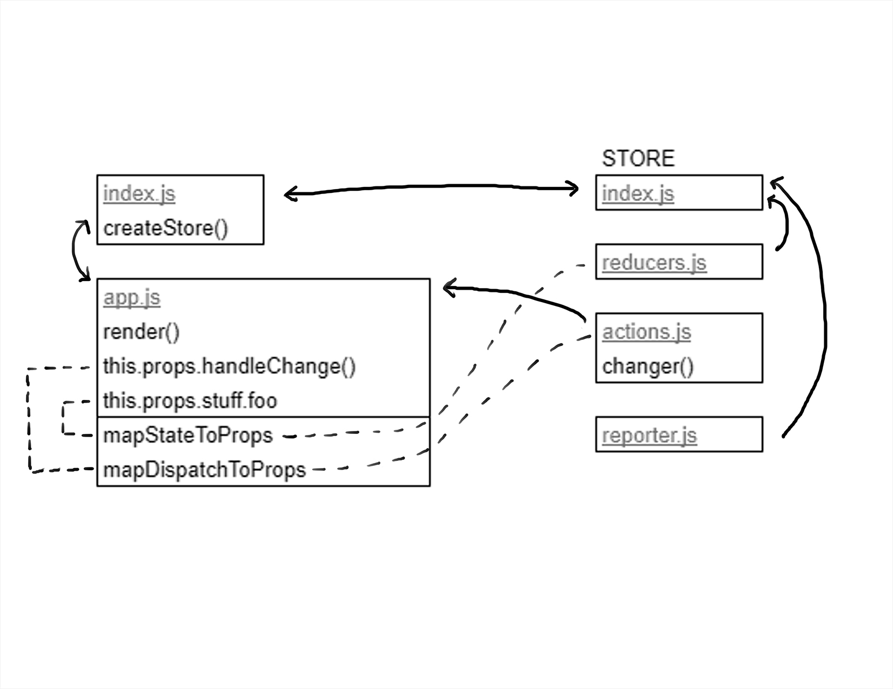
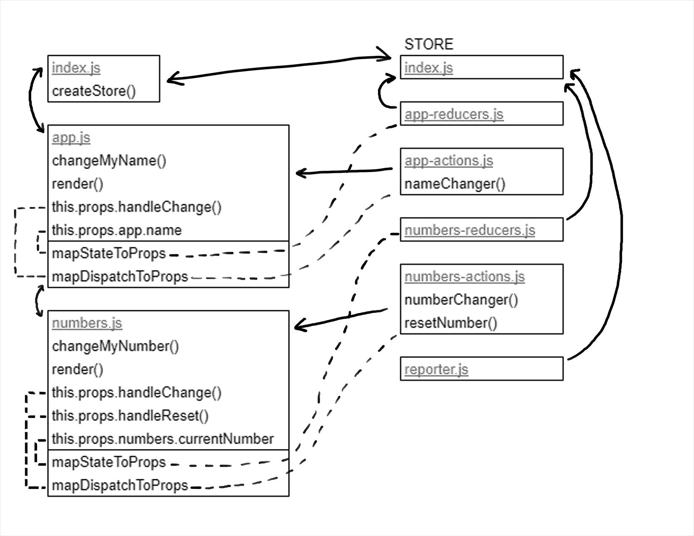

 LAB 31
=================================================

## Application State

### Author: Katherine Smith

### Links and Resources
* [Connect to a store](https://codesandbox.io/s/4rz165l614)
* [Create a new reducer](https://codesandbox.io/s/0qpr4nq8zl)

---

## Connect to a store 
### Modules
#### `index.js`
- Imports the App component
- Creates the store and connects to the store
- Contains the Main component
  - Passes the store down to the App component
  - Renders the App component
#### `app.js`
- Imports actions from the store
- Contains App component
  - Renders div that uses this.props.handleChange and displays this.props.stuff.foo
- Contains mapStateToProps() which maps state to props
- Contains mapDispatchToProps() which maps dispatch to props
- Contains and exports the connected App component

### Store Modules
#### `index.js`
- Imports reducers and reporter
- Exports function to create the store
#### `actions.js`
- Contains actions to be dispatched
#### `reducers.js`
- Maintains state for the store
#### `reporter.js`
- Provides middleware for the store

#### UML

---

## Create a new reducer
### Modules
#### `index.js`
- Imports the App component
- Creates the store and connects to the store
- Contains the Main component
  - Passes the store down to the App component
  - Renders the App component
#### `app.js`
- Imports the Numbers component
- Imports app actions from the store
- Contains App component
  - Contains changeMyName method
  - Renders div that uses this.changeMyName and displays this.props.app.name
  - Renders the Numbers component
- Contains mapStateToProps() which maps app state to props
- Contains mapDispatchToProps() which maps app dispatch to props
- Contains and exports the connected App component
#### `numbers.js`
- Imports numbers actions from the store
- Contains Numbers component
  - Contains changeMyNumber method
  - Renders div that uses this.changeMyNumber and displays this.props.numbers.currentNumber
  - Renders button that uses this.props.handleReset
- Contains mapStateToProps() which maps numbers state to props
- Contains mapDispatchToProps() which maps numbers dispatch to props
- Contains and exports the connected Numbers component

### Store Modules
#### `index.js`
- Imports app reducers, numbers reducers, and reporter
- Exports function to create the store
#### `app-actions.js`
- Contains app actions to be dispatched
#### `numbers-actions.js`
- Contains numbers actions to be dispatched
#### `app-reducers.js`
- Maintains app state for the store
#### `numbers-reducers.js`
- Maintains numbers state for the store
#### `reporter.js`
- Provides middleware for the store

#### UML
